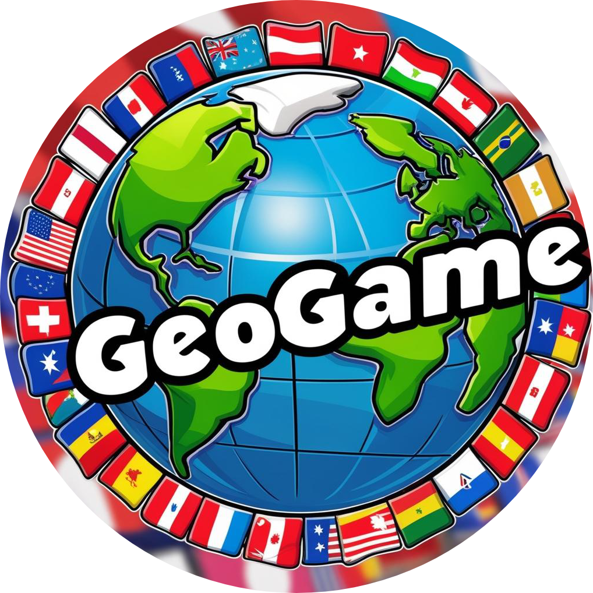

# **GeoGame (C++ Version)**

  

  

GeoGame, ülkelere dair başkent, bayrak ve coğrafi bilgilerle kendinizi test edebileceğiniz eğitici bir oyundur. Bu sürüm, **C++** ile geliştirilmiştir ve **otomatik güncelleme sistemi** sayesinde her zaman en güncel içerikle çalışır.

## **Nasıl Çalışır?**

GeoGame `.exe` dosyasını çalıştırdığınızda, uygulama GitHub deposundan gerekli olan tüm veri dosyalarını **otomatik olarak indirir**, ardından oyunu başlatır.
Bu yapı sayesinde kullanıcılar her zaman en güncel içerikle oyunu oynar.

## **İndir**

Oyunu en son sürümüyle indirmek için:

➡️ [**GeoGame - Son Sürüm (C++)**](https://github.com/keremlolgg/GeoGamecpp/releases/latest)

## **Özellikler**

✅ Ülkelerin başkentleri, bayrakları ve konumları hakkında bilgi testleri
✅ Kıtalar hakkında öğretici bilgiler
✅ Modern kullanıcı arayüzü
✅ Sadece Windows platformu için optimize edilmiş bağımsız çalışabilir uygulama
✅ Otomatik güncelleme sistemi

## **Kullanılan Teknolojiler**

* **C++** – Oyunun temel programlama dili
* **SFML** – Windows ortamında uygulama arayüzü oluşturmak için
* **GitHub** – Veri dosyalarının barındırıldığı kaynak

## **Projenin Flutter Sürümü**

Mobil ve web desteğiyle yeniden yazılmış Flutter sürümüne göz atmak için:
➡️ [**Flutter Sürümü (GeoGame)**](https://github.com/keremlolgg/GeoGame)

## **Lisans**

Bu proje **GPL Lisansı** ile lisanslanmıştır. Detaylar için [**LICENSE**](LICENSE) dosyasına bakabilirsiniz.

